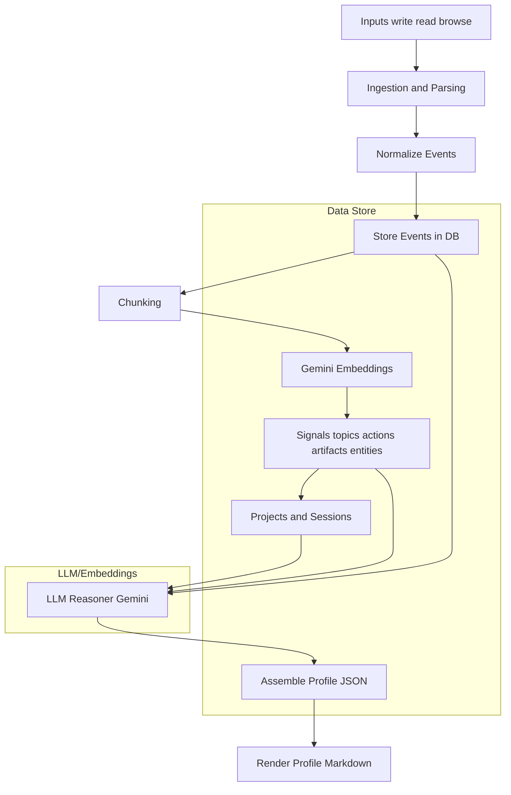

# Architecture

```mermaid
flowchart TD
  A[Inputs write read browse] --> B[Ingestion and Parsing]
  B --> C[Normalize Events]
  C --> D[Store Events in DB]
  D --> E[Chunking]
  E --> F[Gemini Embeddings]
  F --> G[Signals topics actions artifacts entities]
  G --> H[Projects and Sessions]
  H --> I[LLM Reasoner Gemini]
  G --> I
  D --> I
  I --> J[Assemble Profile JSON]
  J --> K[Render Profile Markdown]

  subgraph Data Store
    D
    F
    G
    H
    J
  end

  subgraph LLM/Embeddings
    F
    I
  end
```
